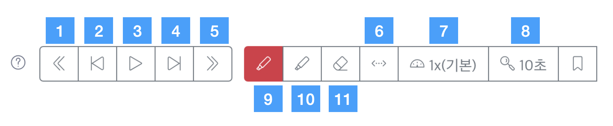
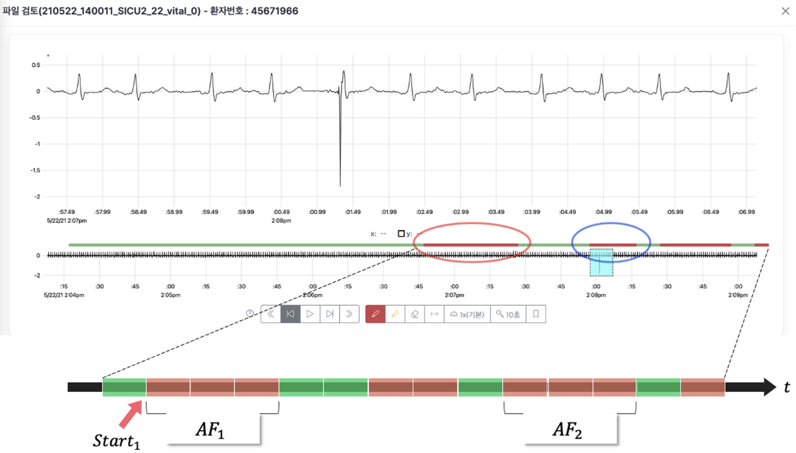

# 3차 라벨링 가이드라인

## **단축키 요약 및 버튼 설명**

- **`Home`** : 맨 처음 Pre label 영역
- **`End`** : 맨 뒤 Pre label 영역
- **`Page up`** [1️⃣ 버튼 동일] : Pre label 상 이전 변화구간 경계로 이동
- **`Page down`** [5️⃣ 버튼 동일] : Pre label 상 다음 변화구간 경계로 이동
- 단위 구간 (기본값 : 10초) 기동 기능
    - `← (좌측 화살표)` [2️⃣ 버튼 동일]
          : 10초 이전으로 이동 (단위 변경 가능 8️⃣ 버튼 이용)
    - `→ (우측 화살표)` [4️⃣ 버튼 동일] 
           : n초 이후로 이동 ( Sapce bar도 이용할 수 있음 )
    - 8️⃣을 이용해서 화면(단위) 길이를 조절할 수 있음. (기본 10초)
- **`C`** [6️⃣ 버튼]: 전체 구간 AFib 마킹
- **`A`** [9️⃣ 버튼]: Onset 마킹 모드로 전환 (빨간 버튼)
- **`D`** [🔟 버튼]: Offset 마킹 모드로 전환
- [7️⃣ 버튼 기능] : [3️⃣ 버튼 - 재생]으로 실행되는 재생 속도 제어

## **라벨링 대상 및 가이드**

### 목표 : AF onset, offset을 검출(detection)하는 것

<aside>
💡 라벨러들의 편의상 `pre-labeling 정보`를 기준을 제시해 드렸지만,  
이는 정답이 아니고, 참고용도이니, `참고용`으로만 활용해주시길 바랍니다.

`제시된 구간 전체`에서 AF의 onset과 offset을 입력해주셔야 합니다.

</aside>

### 라벨링 대상 데이터 선정 기준

- 검토할 데이터는 pre-label 모델의 `예상 onset 구간`을 기준으로 만들어져 있음
- pre-label 모델은 `30초` 미만의 AF의 신호는 onset 기준에서 제외함
    - 30초 : 의학적으로 의미있는 최소 AF 구간 길이
- 10초 단위 3개의 분절(segment)이 연속적으로 AF로 판단되면 AF 대상으로 선정하였음.
    - 10초 전체가 AF가 아니어도 각 Segment는 AF로 분류될 수 있음.
    - 따라서, AF로 판단된 대상이 실제 길이가 30초 보다 작을 수 있음.

### 라벨링 대상 AF 병합 기준

- AF가 offset 된 후 30초 이내에 다시 발생하면 (즉, AF offset에서 다음 onset까지의 길이가 30초 미만이면), 두 AF는 같은 AF로 판단하였음.
- 아래 그림처럼 AF_1과 AF_2처럼 AF 사이 간격(offset에서 다음 onset까지)이
30초 이상 떨어진 구간의 AF는 별도의 AF로 보고, 대상 구간을 2개로 분리하였음.

- 30초 미만 pre-label 모델 결과 표시 (라벨링 진행 시 혼동을 유발한다면, 추후에 제거될 수 있음)
    - 위 그림의 AF_1과 AF_2 사이 2개의 Segment가 AF 후보로 표시되어 있음
    - 30초 기준으로 보면 AF가 아닌 샘플이지만, pre-label은 10초 단위 판단하고 있음

### 라벨링 Rule

- 제시된 구간 전체`(각 파일 최대 5분)`에 대해서 검토하고 라벨링 진행
    - 우선검토대상 개념 없이, `업로드된 모든 파일을 검토한 후 검토완료 버튼 실행` 필요
    - pre-labeling 모델의 결과(빨간색과 초록색, 회색)은 참조용으로 bias가 되지 않도록 주의
- 라벨러는 AF 구간의 길이를 자세히 계산하지 않고 라벨링하되 대략 15초 이내의 짧은 구간은 무시할 수 있음
- 모든 파일 내에서 `항상 onset, offset 페어`로 마킹 (onset 이후 또다시 onset 마킹을 시도하면 경고창 표시됨)
    - AF 구간이 검토 파일의 `'맨 앞에서' 이전 파일`과, 또는 `'맨 뒤에서' 다음 파일과 이어지는 경우에도 맨앞에 onset, 맨뒤에 offset 마킹`
    - `AF이 없다면 마킹 없이 검토 완료`를 클릭
- 1차 데이터에서 적용되던 Afib 구간 사이 간격이 30분 미만인 것을 라벨러가 판단하여 하나의 Afib 구간으로 마킹하는 가이드라인은 폐지(2차와 동일)
    - Afib 구간 사이 간격(offset에서 다음 onset까지)에 상관없이 30초 이상 유지되는 Afib은 모든 구간을 구분하여 마킹
- 관리자는 일반 라벨러 2명 이상이 검토하여 "검토완료" 표시된 파일 중 "검토불일치"에도 표시된 파일에 대해 최종 검토 후 검토완료 버튼 실행 필요
    - 본인이 검토한 파일은 "본인검토"의 체크 표시로 확인 가능

## **참고사항**

- False Negative(FN)를 없애기 위해, 민감하게 샘플을 뽑았으므로, 검토대상 환자의 업로드된 파일에서 AF이 실제로는 출현하지 않는 경우도 다수 예상됨
- 최대 20개의 AF onset  예상 구간을 업로드하였으나, 검토 후 Afib이 출현하지 않은 환자는 Pre label 상 다음 Afib이 나타나는 시점의 데이터를 추가로 업로드할 수 있음.
- [test00@test.com](mailto:test00@test.com) 관리자 계정으로는 라벨링해도 추후 필터되어 실제 데이터로 사용하지 않음
- 시스템에서 파란색으로 표시되는 것은, 현재 선택된 파일이 아니고, 직전에 파일을 열어서 검토했던 샘플을 나타냄.
- 대상 구간이 2개의 파일에 걸쳐 있는 경우 아래 그림에서와 같이 일부 공백이 있음

